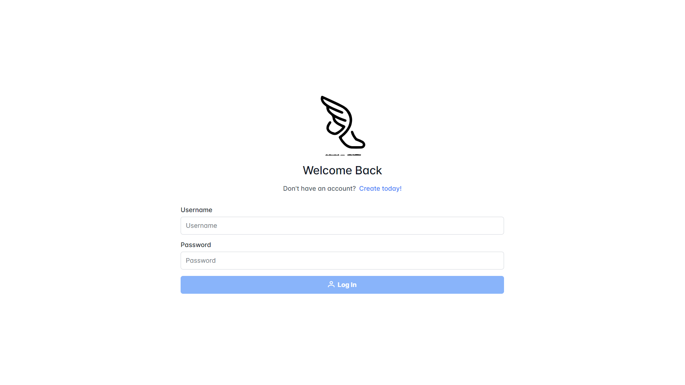
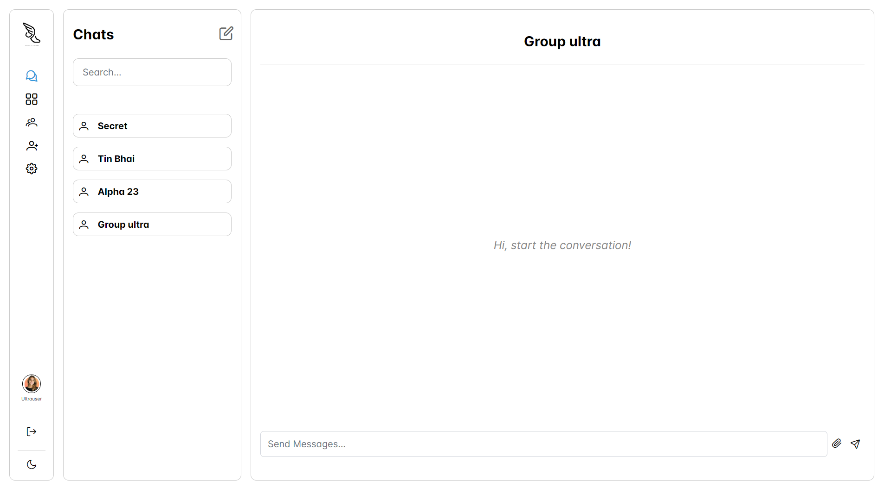
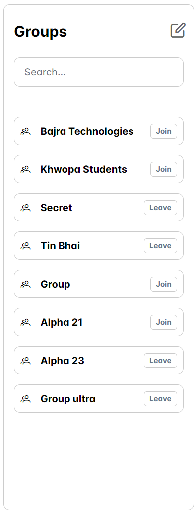
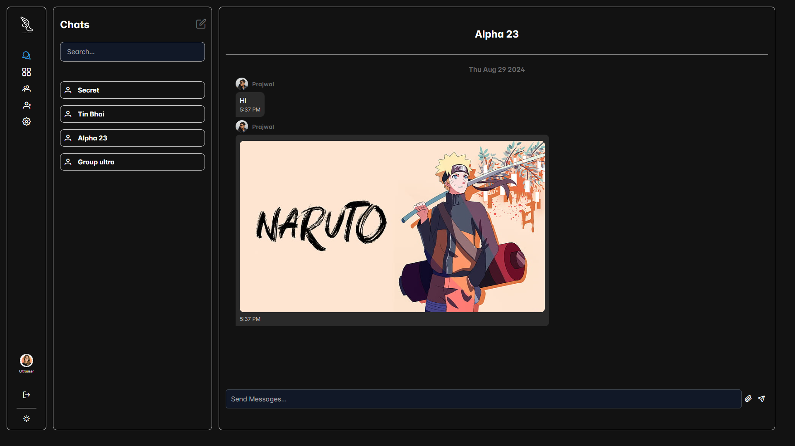

# HERMES-CHAT-APPLICATION

This is a real-time chat application built with Node.js, Express, MongoDB, and Angular. It features user authentication, real-time messaging, chat groups, and profile management. The backend uses Socket.io for real-time communication, while the frontend is built using Angular for a smooth user experience.

## Features

- User authentication (login, register)
- Real-time messaging
- Chat groups (create, join, leave)
- Profile management (update profile picture)
- Friend requests
- Responsive design for mobile and desktop

## Screenshots

### Login Page


### Chat Page


### Groups


### Dark Mode


## Tech Stack

### Frontend
- [Angular](https://angular.io/)
- [PrimeNG](https://www.primefaces.org/primeng/)
- [SCSS](https://sass-lang.com/)

### Backend
- [Node.js](https://nodejs.org/)
- [Express](https://expressjs.com/)
- [MongoDB](https://www.mongodb.com/)
- [Socket.io](https://socket.io/)

## Prerequisites

- [Node.js](https://nodejs.org/) (v14+)
- [MongoDB](https://www.mongodb.com/) (v4+)
- [Angular CLI](https://angular.io/cli) (v17+)

## Getting Started

Follow these instructions to set up the project locally.

### 1. Clone the repository

```bash
git clone https://github.com/ShresthaPrajwal/Hermes_chat_app.git
cd Hermes_chat_app
```

### 2. Backend Setup

```bash
cd backend
npm install 
```
#### Setup Environment Variables

```env
PORT = 3000
MONGO_URI = mongo_url_here
SECRET_KEY = key_here
STORAGE_BUCKET_URL = sample
FIREBASE_BUCKET_CONFIG = sample
```

```bash
npm run dev
```
The backend will run on http://localhost:3000.


### 3. Frontend Setup

```bash
cd frontend
npm install
```

#### Setup Environment

Setup environment.ts file as:
```js
export const environment = {
  production: false,
  apiUrl: 'http://localhost:3000/api'
};
```

Setup socket-config.ts file as:
```js
import { SocketIoConfig } from 'ngx-socket-io';

export const socketConfig: SocketIoConfig = {
  url: `http://localhost:3000/api`,
  options: {},
};
```

Finally
```bash
ng serve    
```

The frontend will be available at http://localhost:4200.

